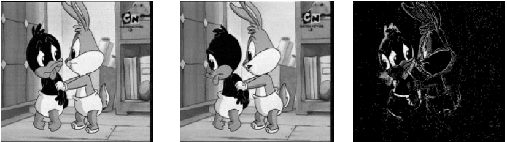
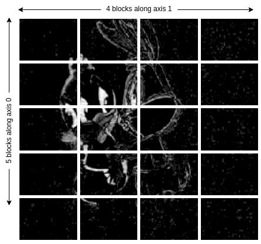
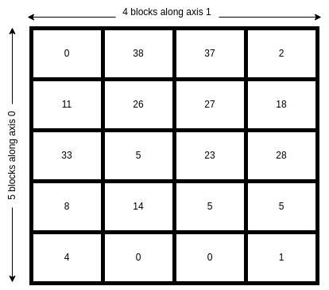
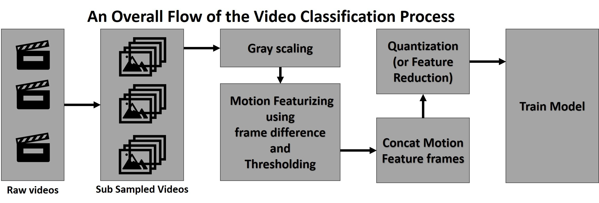

# Assignment 1

## Total 16 marks 

## Decision Tree Implementation [5 marks]

1. Complete the decision tree implementation in tree/base.py. **[4 marks]**
The code should be written in Python and not use existing libraries other than the ones shared in class or already imported in the code. Your decision tree should work for four cases: i) discrete features, discrete output; ii) discrete features, real output; iii) real features, discrete output; real features, real output. **Your model should accept real inputs only (for discrete inputs, you may convert the attributes into one-hot encoded vectors)**. 
 Your decision tree should be able to use InformationGain using Entropy or GiniIndex as the criteria for splitting for discrete output. Your decision tree should be able to use InformationGain using MSE as the criteria for splitting for real output. Your code should also be able to plot/display the decision tree. 

    > You should be editing the following files.
  
    - `metrics.py`: Complete the performance metrics functions in this file. 

    - `usage.py`: Run this file to check your solutions.

    - tree (Directory): Module for decision tree.
      - `base.py` : Complete Decision Tree Class.
      - `utils.py`: Complete all utility functions.
      - `__init__.py`: **Do not edit this**

    > You should run _usage.py_ to check your solutions. 

1. 
    Generate your dataset using the following lines of code

    ```python
    from sklearn.datasets import make_classification
    X, y = make_classification(
    n_features=2, n_redundant=0, n_informative=2, random_state=1, n_clusters_per_class=2, class_sep=0.5)

    # For plotting
    import matplotlib.pyplot as plt
    plt.scatter(X[:, 0], X[:, 1], c=y)
    ```

    a) Show the usage of *your decision tree* on the above dataset. The first 70% of the data should be used for training purposes and the remaining 30% for test purposes. Show the accuracy, per-class precision and recall of the decision tree you implemented on the test dataset. **[1 mark]**

    b) Use 5 fold cross-validation on the dataset. Using nested cross-validation find the optimum depth of the tree. **[1 mark]**
    
    > You should be editing `classification-exp.py` for the code containing the above experiments.

2. 
    a) Show the usage of your decision tree for the [automotive efficiency](https://archive.ics.uci.edu/ml/datasets/auto+mpg) problem. **[0.5 marks]**
    
    b) Compare the performance of your model with the decision tree module from scikit learn. **[0.5 marks]**
    
   > You should be editing `auto-efficiency.py` for the code containing the above experiments.
    
3. Create some fake data to do some experiments on the runtime complexity of your decision tree algorithm. Create a dataset with N samples and M binary features. Vary M and N to plot the time taken for: 1) learning the tree, 2) predicting for test data. How do these results compare with theoretical time complexity for decision tree creation and prediction. You should do the comparison for all the four cases of decision trees. **[2 marks]**	

    >You should be editing `experiments.py` for the code containing the above experiments.


You must answer the subjectve questions (timing analysis, displaying plots) by creating `assignment_q<question-number>_subjective_answers.md`


# Human Activity Recognition (Mini Project)
Human Activity Recognition (HAR) refers to the capability of machines to identify various activities performed by the users. The knowledge acquired from these recognition systems is integrated into many applications where the associated device uses it to identify actions or gestures and performs predefined tasks in response.

## Task1 : Prompt Engineering for Large Language Models (LLMs) [5 marks]

### Zero-shot and Few Shot Prompting :
Zero-shot prompting involves providing a language model with a prompt or a set of instructions that allows it to generate text or perform a task without any explicit training data or labeled examples. The model is expected to generate high-quality text or perform the task accurately based solely on the prompt and its internal knowledge.

Few-shot prompting is similar to zero-shot prompting, but it involves providing the model with a limited number of labeled examples or prompts that are relevant to the specific task or dataset. The model is then expected to generate high-quality text or perform the task accurately based on the few labeled examples and its internal knowledge.

### Task Description :
You have been provided with a [Python notebook](./Mini-Project/Task1-llm/ZeroShot_FewShot.ipynb) that demonstrates how to use zero-shot and few-shot prompting with a language model (LLM). The example in the notebook involves text-based tasks, but LLMs can also be applied to a wide range of tasks (Students intrested in learning more can read [here](https://deepai.org/publication/large-language-models-are-few-shot-health-learners) and [here](https://arxiv.org/pdf/2305.15525v1)). In this task, we are interested in classifying human activities based on featurized accelerometer data. we will be using a publically available dataset called [UCI-HAR](https://ieeexplore.ieee.org/stamp/stamp.jsp?tp=&arnumber=8567275). The dataset is available to download [here](https://archive.ics.uci.edu/dataset/240/human+activity+recognition+using+smartphones). Just for your referenc a youtube video of the authors collecting participant's accelerometer data is also available [here](http://www.youtube.com/watch?v=XOEN9W05_4A). 

Queries will be provided in the form of featurized accelerometer data and the model should predict the activity performed. 
* **Zero shot learning** : The model should be able to predict the activity based on the accelerometer data without any explicit training data or labeled examples. 
* **Few Shot Learning** :The model should also be able to predict the activity based on a limited number of labeled examples or prompts that are relevant to the specific task. 

It is advised to either write a markdown file or use a Python notebook to demonstrate your reasoning, results and findings.

### Questions
1. Plot the waveform for one sample data from each activity class. Are you able to see any difference/similarities between the activities? You can plot a subplot having 6 colunms to show differences/similarities between the activities. Do you think the model will be able to classify the activities based on the data? **[0.5 marks]**
2. Do you think we need a machine learning model to differentiate between static activities (laying, sitting, standing) and dynamic activities(walking, walking_downstairs, walking_upstairs)? Look at the linear acceleration $(acc_x^2+acc_y^2+acc_z^2)$ for each activity and justify your answer. **[0.5 marks]**
3. Demonstrate how to use Zero-Shot Learning and Few-Shot Learning to classify human activities based on the featurized accelerometer data. Qualitatively demonstrate the performance of Few-Shot Learning with Zero-Shot Learning. Which method performs better? Why?  **[1.5 marks]**
5. Quantitatively compare the accuracy of Few-Shot Learning with Decision Trees (You may use a subset of the test set if you encounter rate-limiting issues). Which method performs better? Why? **[2 marks]**
6. What are the limitations of Zero-Shot Learning and Few-Shot Learning in the context of classifying human activities based on featurized accelerometer data? **[0.5 marks]**

#### NOTE :
1. To obtain API key go to the GroqCloud Developer Console at https://console.groq.com/login. Follow the Quickstart guide to obtain your API key.
2. ***DO NOT share your API key with anyone or make it public or upload it to any public repository such as for this assignment. If the key is found in the code, you will be penalized with a <u>0.5 marks deduction</u>.***


## Task 2: Vision based Human Activity Recognition

In this task, we need to recognise activity performed in a video via a Decision Tree Classifier

### Dataset

Use atleast three classes from the [UCF9 Dataset](https://iitgnacin-my.sharepoint.com/:f:/g/personal/22210006_iitgn_ac_in/EmgKF7jE-2xEnO5zYb3GvJ8BN4RncsgXYJphZ4ys2BCYUg?e=rN9s03) which
contains 9 classes from [UCF101 Dataset](https://www.crcv.ucf.edu/data/UCF101.php). Feel free to choose any other classes from the
[UCF101 Dataset](https://www.crcv.ucf.edu/data/UCF101.php). Split each classes into train and validation split containing 80 and 20
samples per class respectively. Use the rest for testing purpose. You
can use [OpenCV](https://opencv.org/get-started/) to load videos.

**QUESTION 1 :** Implement the `get_data` function in the `Mini-Project/Task2/utils.py` file. This function should be able to load video data for training, validation, or test split, based on the specified input. **[1 mark]**

### Motion Feature Extraction

A video consists of consecutive images (aka frames) which when displayed at certain speed, it forms a video. To extract motion related
information, we wil perform pixel-wise difference of consecutive frames (please checkout opencv [absolute frame difference](https://shimat.github.io/opencvsharp_docs/html/6c7cefd1-59bc-a595-fe2a-0c8a709f8d16.htm)). `Figure 1` shows an example of difference between two consecutive
frames:

| <p align="center">Figure 1</p> |
|---|
|  |

**QUESTION 2 :** Implement the `pre_process` function at `Mini-Project/Task2/utils.py` that performs following pre-processing **[0.5 marks]**:

1. Convert all color frames to grayscale
2. Use the following formula for calculating motion features:\
    $` M_k (i,j) = \begin{cases} 255,& D_k (i,j) \geq \text{threshold} \\ 0,& \text{otherwise}\end{cases}`$

    where

    * $D_k (i,j) = | I_k(i,j) - I_{k+1} (i,j) |$ ; $1 \leq i \leq width, 1 \leq j \leq height$
    * $I_k(i,j)$ is the pixel intensity of $k^{th}$ frame at location $(i,j)$
    * $M_k (i,j)$ is the motion information between $k^{th}$ and $(k+1)^{th}$ frame for the pixel at location $(i,j)$
    * The value of `threshold` is a hyper-parameter. Feel free to try multiple values.

**QUESTION 3 :**: Visualize any video before before and after pre-processing **[0.5 marks]**:

### Dimensionality reduction

The frames in the dataset is of shape 240 x 320 which can be very large to train a Decision tree. Moreover, we need not use all pixel for
classification as most neigbouring pixels could be redundant. Hence, we provide you class at `Mini-Project/Task2/dimensionality_reduction.py`
named `Quantizer` which quantizes (reduces) the dimensionality of the frames. The working of the quantizer is described below:

1. The quantizer takes a frame and subdivides it into small blocks. For example, in Figure 2, a frame with motion feature is divided into 5 x 4 blocks.
    | <p align="center">Figure 2</p> |
    |---|
    |  |

2. Each of the block is then mapped to certain number. For example, if number of points to map is provided as 40, then each block would be mapped
    to a number between 0-39. Figure 3 shows an instance of such mapping.
    | <p align="center">Figure 3</p> |
    |---|
    |  |

3. The matrix is then flattened to give a vector. In the above example, a frame of size 240 x 320 is transformed to a 20 dimensional vector.

#### Usage

The usage of `Quantizer` is described below. Also check the comments provided in the file:

```py
from dimensionality_reduction import Quantizer
...
...
...
# Create an instance of Quantizer as shown below.
# In this case, the quantizer will divide frames in 5 x 4 blocks.
# If a frame is of size 240, 320 then each block will be of dimension
# 48 x 80. Since, the num_points=40, each block will be mapped to a number
# between 0-39
quantizer = Quantizer(h_blocks=5, w_blocks=4, num_points=40)
...
...
...
# Before using the the quantizer, we need to train it to learn the mappings 
# betwwen blocks and numbers. This can be done using `fit()` function which
# accepts an array of shape (n_frames, height, weigth).
quantizer.fit(X_train)
# You need to break the videos into frames and concat them to make an array
# of shape (n_frames, height, weigth)
...
# Use `quantize()` function to quatize images. This function also accepts
# an array of shape (n_frames, height, weigth) and return an array of shape
# (n_frames, h_blocks * w_blocks):
quantizer.quantize(X_val)
```

**NOTE:** You don't have to implement the quantizer, just use the provided quantizer at `Mini-Project/Task2/dimensionality_reduction.py`

### Classification



**QUESTION 4 :** Preprocess the data, use the provided quantizer to reduce the dimensions and train a decision tree classifier to classify the videos among activities.
Compare the performance of sklearn and your implementation in terms of accuracy and run-time. **[2 marks]**
Use the file at `Mini-Project/Task2/video_classification.py` for your implementation. You may create helper function for your convenience.

HINT :
1. Break the videos into frames and train the classifier to classify a frame. To classify a video during inference, classify each frames separately and assign the
label having maximun frequency. 
2. You may sub-smaple the number of frames per video.

**QUESTION 5 :** How does the value of threshold duirng motion feature extraction impacts the performance in terms of accuracy. Explain with
an example. **[1 marks]**

**QUESTION 6 :** Record your own video among the selected classes and report the performance. For each class, show an example of
success and failure with a brief explanation **[1 marks]**

---


### **Genral Instructions :**
1. Show your results in a Jupyter Notebook or an MD file. If you opt for using an MD file, you should also include the code.
2. If you wish you can use the scikit-learn implementation of Decision Tree for the Mini-Project.

